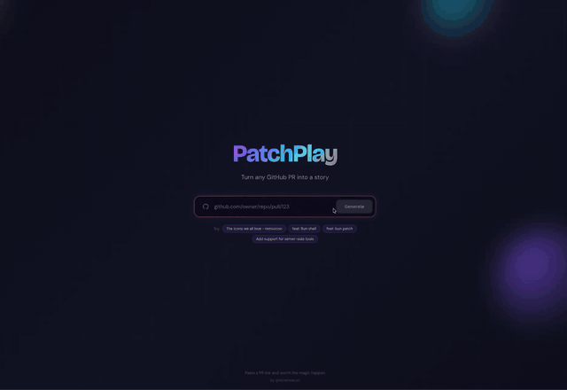

# PatchPlay

Turn any GitHub PR into a short-form video.

Paste a PR link, get an animated video summarizing what changed — headline, key bullets, stats. Built with Remotion for in-browser video rendering and AI for PR analysis.



**[Try it live](https://patchplay.vercel.app)**

## How it works

1. Paste a GitHub PR URL
2. AI analyzes the diff — title, description, changed files
3. Generates a video script: headline, bullet points, vibe, accent color
4. Remotion renders an animated video with intro, headlines, bullets, and outro scenes
5. Watch and share

## Tech stack

- **React 19** + **Vite** — frontend
- **Remotion** — programmatic video generation in the browser
- **Vercel AI SDK** + **OpenAI** — PR analysis and summarization
- **Vercel Serverless Functions** — API backend
- **TypeScript** throughout

## Development

```bash
npm install
npm run dev
```

Create `.env.local` with:

```
OPENAI_API_KEY=your-key
```

## License

MIT
# reeldiff
